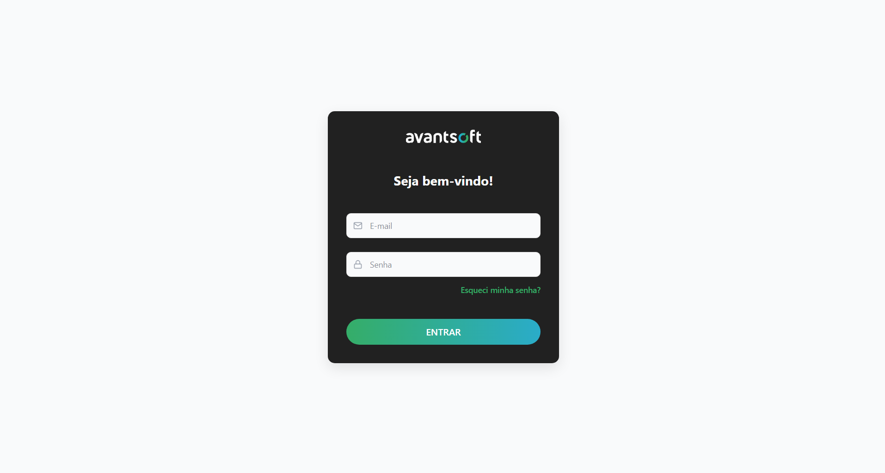
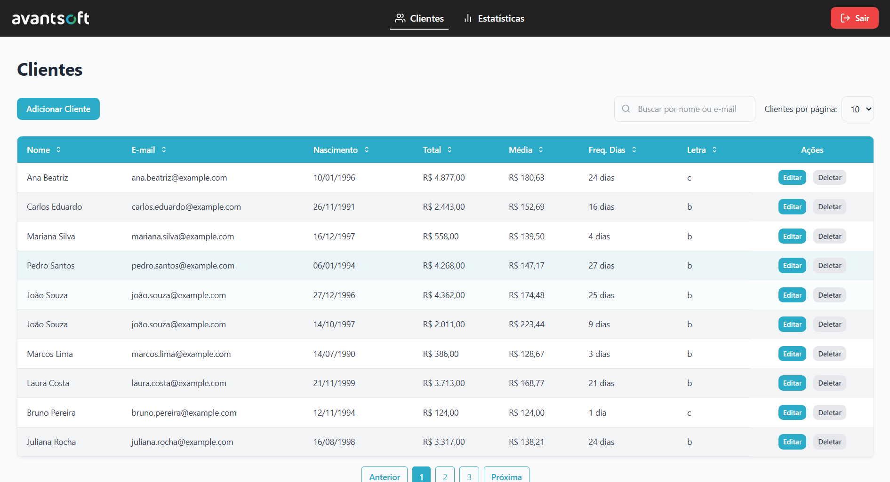
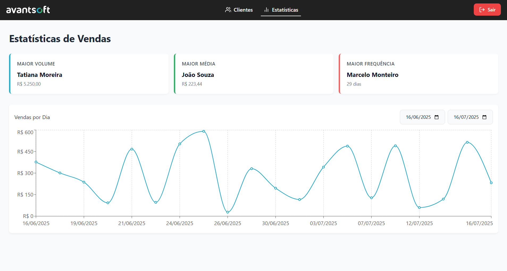

# 📊 Gerenciador de Clientes Avantsoft

Aplicação web para cadastro, edição, listagem e exclusão de clientes, com visualização de dados estatísticos de vendas.

---

## 📸 Preview





---

## 📦 Estrutura de Pastas
```text
📦 avantsoft-customer-manager
 ┣ 📂 public/              # Arquivos estáticos (favicon, mockServiceWorker.js)
 ┣ 📂 src/
 ┃ ┣ 📂 components/        # Componentes reutilizáveis (Button, Input, Modal, NavBar)
 ┃ ┣ 📂 pages/             # Páginas principais (Login, Clients, Stats)
 ┃ ┣ 📂 services/          # Serviços de API (mock via MSW)
 ┃ ┣ 📂 utils/             # Funções utilitárias
 ┃ ┗ 📄 main.tsx           # Arquivo de entrada
 ┣ 📄 package.json
 ┗ 📄 vite.config.ts
```
---

## 🚀 Funcionalidades

- ✅ Listagem paginada de clientes
- 🔍 Filtro e busca por nome ou e-mail
- 📝 Adição e edição de clientes
- 📅 Ordenação dinâmica da listagem por qualquer coluna
- 📧 Validação de formulário
- 📈 Estatísticas de vendas por cliente:
  - Total vendido
  - Valor médio
  - Frequência de compra
- 📈 Estatísticas de vendas por dia
- 🍞 Notificações via toast
- 💅 Estilização com Sass Modules e variáveis globais

---

## 🛠️ Tecnologias utilizadas

- **Framework:** [React](https://react.dev/)  
- **Linguagem:** [TypeScript](https://www.typescriptlang.org/)  
- **Build:** [Vite](https://vitejs.dev/)  
- **Estilos:** [Sass Modules](https://sass-lang.com/)  
- **UI e UX:**
  - [React Toastify](https://fkhadra.github.io/react-toastify/)
  - [React Icons](https://react-icons.github.io/react-icons/)
  - [Classnames](https://www.npmjs.com/package/classnames)
- **Qualidade de código:**
  - [ESLint](https://eslint.org/)
- **Testes:**
  - [Jest](https://jestjs.io/)
  - [React Testing Library](https://testing-library.com/)

---

## 🔧 Instalação e uso

### ✅ 1. Clonar o repositório
```bash
git clone https://github.com/SEU-USUARIO/avantsoft-customer-manager.git
cd avantsoft-customer-manager
```

### ✅ 2. Instalar dependências
```bash
npm install
```

### ✅ 3. Executar em modo de desenvolvimento
```bash
npm run dev
```

---

## 🧪 Testes
Os testes utilizam Jest + React Testing Library.

Para executar os testes:
```bash
npm run test
```

---

## ⚠️ MSW (Mock Service Worker)
Este projeto usa MSW para simular requisições da API e rodar a aplicação sem um backend real.
